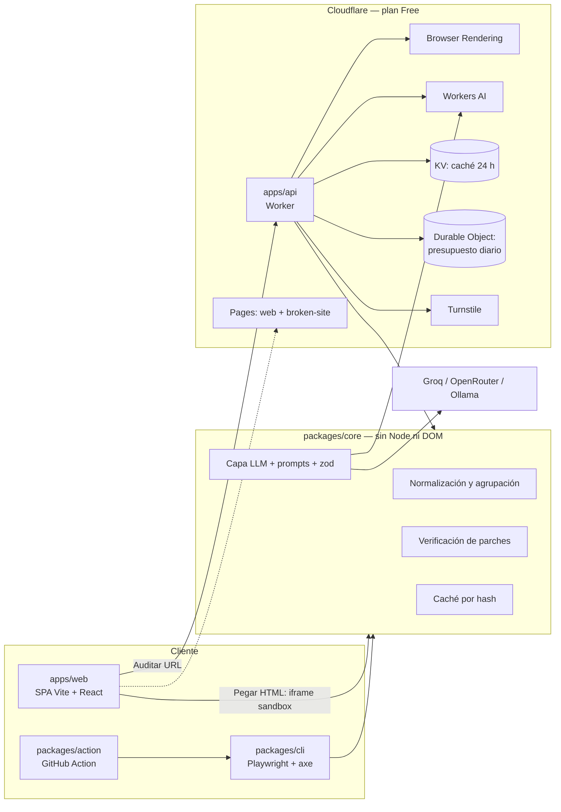

# Allytic — documento vivo de idea y decisiones

> Fuente de verdad del proyecto. Se actualiza en el mismo commit que cualquier cambio de
> funcionalidad, arquitectura, stack, alcance, límites o decisiones (ver `CLAUDE.md`).
>
> Estado: **fase 3 completada** (la CLI audita, y con `--fix` pide a un LLM explicación y parche
> para cada problema y verifica el parche reejecutando axe en la página). Sitio de ejemplo en
> <https://allytic-broken-site.pages.dev>.
> Última revisión: 2026-10-07.

## 1. Visión y problema

Los auditores automáticos de accesibilidad (axe, Lighthouse, WAVE) dicen **qué** falla, pero
dejan dos huecos: quien recibe el informe a menudo no entiende a quién perjudica el problema, y
el arreglo queda como trabajo manual. Los asistentes de IA cubren ese hueco con sugerencias que
nadie comprueba: un parche plausible puede no arreglar la regla o romper otra.

Allytic detecta problemas WCAG 2.2 AA con axe-core y usa un LLM para:

1. Explicar cada problema en lenguaje claro: a quién afecta y por qué.
2. Proponer un parche concreto (antes / después).
3. **Verificar el parche**: aplicarlo y volver a ejecutar axe. Solo se marca "Verificado" si la
   regla deja de fallar y no aparecen violaciones nuevas. Si falla, un único reintento pasando al
   modelo el error.

**Principio de honestidad.** Las pruebas automáticas cubren solo una parte de WCAG. Allytic
nunca afirma "cumplimiento" ni "conformidad legal", y lo dice en la interfaz y en cada informe.

## 2. Usuarios objetivo

- **Desarrolladores web** que quieren arreglar problemas, no solo listarlos (CLI y Action).
- **Equipos pequeños sin especialista en accesibilidad**, que necesitan entender el impacto.
- **Quien evalúa el portfolio**: debe poder ver el valor en un minuto con el modo demo, sin
  registrarse ni gastar cuota.

## 3. Alcance

**MVP**

- CLI `allytic audit <url|archivo>` con salidas JSON, Markdown, HTML autocontenido y SARIF.
- Explicación + parche + verificación con LLM, caché y límite de llamadas.
- API en Cloudflare Workers para auditar URLs con protección anti-SSRF y presupuesto diario.
- Web con modos demo, auditar URL, pegar HTML (100 % cliente), ver informe y BYOK.
- Evals reproducibles que comparan modelos gratuitos.
- GitHub Action que sube SARIF y comenta el PR.

**Auditar URLs de terceros es un objetivo del producto**

El objetivo final es que cualquiera pueda introducir una URL pública, también de un sitio que no
es suyo, y auditarla. Lo que se limita a `fixtures/broken-site` son solo los **ejemplos
precalculados** que la web enseña por defecto. Consecuencias que se tienen en cuenta desde ya:

- La CLI acepta cualquier URL http(s) sin restricciones: se ejecuta en la máquina de quien la usa.
- La API (fase 3b) acepta cualquier URL pública, y por eso la protección anti-SSRF, Turnstile, el
  rate limit y el presupuesto diario son requisitos, no extras.
- Los resultados de sitios de terceros se devuelven a quien los pide y se cachean 24 h, pero no
  se listan, no se indexan y no se publican como ejemplos.
- Nada de inicio de sesión ni de formularios: solo se carga la página pública, una vez.
- Los informes dicen siempre que no son una declaración de conformidad; eso importa más aún
  cuando el sitio auditado es de otra persona.

**Siguiente**

- Rastreo de varias páginas de un mismo sitio.
- Parches sobre el código fuente (hoy se parchea el DOM renderizado).
- Más idiomas en las explicaciones.

**Descartado**

- Declaraciones de conformidad o certificación legal: no se pueden respaldar con pruebas automáticas.
- Auditorías de páginas tras inicio de sesión en la demo pública (riesgo de credenciales).
- Overlays o "arreglos" inyectados en producción: no resuelven el problema de fondo.
- Mostrar auditorías de sitios de terceros como ejemplo público.

## 4. Arquitectura

Monorepo pnpm con TypeScript estricto:

| Workspace | Responsabilidad | Fase |
| --- | --- | --- |
| `packages/core` | Tipos de dominio, normalización y agrupación de resultados de axe, capa LLM, prompts, esquemas zod, caché y verificación. API pública sin dependencias de Node ni del DOM. | 2–3 |
| `packages/cli` | `allytic audit`, Playwright + `@axe-core/playwright`, formatos de salida. | 2 |
| `packages/page-scripts` | Funciones autocontenidas que se ejecutan **dentro** de la página auditada para leer un elemento, aplicar un parche, deshacerlo y localizar el elemento parcheado. Las usa la CLI vía `page.evaluate`; las usarán la API y el iframe de la web. | 3 |
| `packages/action` | GitHub Action sobre la CLI: SARIF + comentario en PR. | 6 |
| `apps/api` | Worker que orquesta auditorías por URL. | 3b |
| `apps/web` | SPA accesible desplegada en Pages. | 5 |
| `fixtures/broken-site` | Sitio con errores intencionados; único objetivo de la demo pública. | 1 |
| `evals/` | Dataset y script de comparación de modelos. | 4 |

## 5. Decisiones técnicas (ADR)

### ADR-001 · Cloudflare frente a Vercel, Netlify y GitHub Pages

- **Contexto.** Hace falta alojar una SPA, una API con navegador headless y un LLM, a coste 0 € y
  sin tarjeta.
- **Decisión.** Cloudflare (Pages, Workers, Browser Rendering, Workers AI, KV, Durable Objects,
  Turnstile).
- **Alternativas.** *Vercel / Netlify*: funciones serverless gratuitas, pero sin navegador
  gestionado ni inferencia incluida; ejecutar Chromium en una función choca con límites de tamaño
  y tiempo, y el plan gratuito de Vercel excluye uso comercial. *GitHub Pages*: solo estático, sin
  API. *VPS gratuito*: suele exigir tarjeta y mantenimiento.
- **Consecuencias.** Un único proveedor y una sola herramienta (Wrangler). A cambio, límites
  duros (10 ms de CPU, 10 min de navegador al día) que condicionan el diseño, y acoplamiento a
  APIs propias, mitigado manteniendo `core` libre de dependencias de plataforma.

### ADR-002 · Nombre "Allytic" (antes "Curbcut")

- **Contexto.** `curbcut` y `curbcut-cli` ya existen en npm y pertenecen a otra herramienta de
  accesibilidad.
- **Decisión.** Renombrar a **Allytic**. `allytic` estaba libre en npm el 2026-10-07.
- **Alternativas.** Publicar bajo scope propio (mantiene la confusión de marca); posponer la
  decisión a la fase 6 (renombrar tarde afecta a README, Action y docs).
- **Consecuencias.** Los paquetes internos usan el scope `@allytic/*`; publicarlos exigirá crear
  esa organización en npm (gratis para paquetes públicos) en la fase 6. La carpeta local conserva
  el nombre antiguo, sin efecto en el repo.

### ADR-003 · Anti-SSRF en dos capas, con riesgo residual declarado

- **Contexto.** El requisito original pedía "comprobar la IP resuelta". En Workers no se puede
  fijar una conexión a una IP ya validada, y quien navega es el navegador remoto, no el Worker.
  Validar por DNS y navegar después es un TOCTOU: el DNS rebinding no se elimina por completo.
- **Decisión.** (1) Validación en el Worker: solo http(s), puertos permitidos, rechazo de IP
  literales privadas / loopback / link-local / metadata en IPv4 e IPv6, resolución DoH de A y
  AAAA. (2) Interceptación en el navegador con `page.route` de **todas** las peticiones
  (redirecciones y subrecursos), revalidando cada destino; máximo 3 redirecciones; service workers
  bloqueados; timeout y tamaño máximo.
- **Alternativas.** Solo validar el nombre (insuficiente); proxy propio con IP fijada (requiere
  infraestructura de pago).
- **Consecuencias.** Los tests de rebinding prueban el validador con un resolver simulado, no
  una garantía absoluta. Riesgo residual documentado; el impacto es limitado porque el navegador
  corre en la red de Cloudflare, no en una red nuestra.

### ADR-004 · Rate limit y presupuesto fuera de KV

- **Contexto.** KV Free permite 1.000 escrituras/día, compartidas con la caché, y es
  eventualmente consistente: como contador se agota pronto y cuenta mal.
- **Decisión.** Binding de Rate Limiting de Workers para el límite por IP (aproximado, por
  ubicación) y un Durable Object con SQLite para el presupuesto diario global (exacto). KV queda
  solo para caché de resultados.
- **Alternativas.** Todo en KV (descartado por lo anterior); todo en Durable Objects (válido,
  más código).
- **Consecuencias.** Un binding más. Pendiente de confirmar en 3b que el binding de Rate Limiting
  funciona en el plan Free; si no, el Durable Object asume también el límite por IP.

### ADR-005 · Groq como respaldo de servidor; OpenRouter para BYOK y evals

- **Contexto.** Los modelos `:free` de OpenRouter admiten 50 peticiones/día sin haber comprado
  créditos.
- **Decisión.** Cadena en servidor: Workers AI → Groq → explicación estática de axe. OpenRouter
  se usa en BYOK y en evals (repartidas en varios días o con subconjunto).
- **Consecuencias.** Las evals de OpenRouter no se pueden ejecutar completas en un día.

### ADR-006 · Estados de verificación y ámbito del parche

- **Contexto.** Reejecutar axe "sobre el nodo" no sirve para reglas de documento
  (`html-has-lang`, `document-title`, `heading-order`) ni para contraste definido en CSS externo.
- **Decisión.** Cada parche declara su ámbito (nodo o documento) y el resultado tiene tres
  estados: **Verificado**, **Fallido** y **No verificable automáticamente**.
- **Consecuencias.** La métrica principal de las evals es el % de parches verificados sobre los
  verificables; los no verificables se informan aparte.

### ADR-007 · Pages con direct upload

- **Contexto.** Cloudflare ofrece Pages y Workers Static Assets para estáticos.
- **Decisión.** Pages, desplegando con `wrangler pages deploy` desde GitHub Actions.
- **Alternativas.** Integración Git de Pages (consume las 500 builds/mes y duplica la CI);
  Workers Static Assets (válido; se reconsiderará si `apps/web` y `apps/api` acaban compartiendo
  dominio).
- **Consecuencias.** El despliegue vive en el repo y es reproducible; no consume builds de Pages.

### ADR-008 · Límites conocidos de SARIF y del comentario en PR

- **Contexto.** GitHub Code Scanning necesita rutas de fichero del repositorio.
- **Decisión.** Para auditorías de URL, el SARIF referencia la URL como artefacto lógico; para
  builds estáticos, el HTML generado. Si el PR viene de un fork (token de solo lectura), la Action
  escribe el resumen en el *job summary* en lugar de comentar.
- **Consecuencias.** Las alertas no apuntan al código fuente original. Documentado en
  limitaciones.

### ADR-009 · Diseño de la CLI (fase 2)

- **Contexto.** La CLI la usan personas en una terminal y también la Action, que necesita varios
  formatos de una sola ejecución del navegador.
- **Decisión.**
  - `allytic audit <url|archivo>`; `--format` repetible o con comas; un formato va a stdout o a
    `--output`, varios exigen `--output-dir` (`allytic-report.<ext>`).
  - El informe va a stdout y el estado a stderr, para poder encadenar con tuberías.
  - Códigos de salida: 0 auditoría completada, 1 umbral de `--fail-on` alcanzado, 2 error de uso
    o de ejecución. Sin `--fail-on` encontrar problemas no es un fallo.
  - Se ejecutan las reglas WCAG 2.2 A y AA de axe **más** las de buenas prácticas, etiquetadas
    como tales; `--wcag-only` las excluye.
  - Una respuesta HTTP ≥ 400 aborta con error: auditar una página de error daría un informe
    engañoso.
  - Las comprobaciones que axe no puede decidir ("incomplete") se muestran aparte como
    "necesita revisión manual" y no cuentan como problemas ni para `--fail-on`.
  - Desde la fase 3: `--fix` activa las explicaciones y parches con IA; `--provider`, `--model`,
    `--max-llm-calls` (20 por defecto) y `--no-cache` solo se aceptan junto a `--fix`. El formato
    por defecto pasa a ser `text`, pensado para leerse en la terminal.
- **Alternativas.** Un subcomando por formato; salida a fichero por defecto (peor para tuberías).
- **Consecuencias.** Los formateadores viven en `core` como funciones puras de texto, así la web
  podrá reutilizarlos en "Ver informe".

### ADR-010 · Informe propio, agrupación y esquema versionado

- **Contexto.** La salida de axe es grande, depende del DOM en sus tipos y no agrupa.
- **Decisión.** `core` valida con zod solo la parte de axe que usa (sin importar los tipos de
  axe-core) y la convierte en un informe propio con `schemaVersion: 1`. Los hallazgos se agrupan
  por regla y **patrón de marcado** (etiqueta + nombres de atributos ordenados, más el valor de
  `role` y `type`), que será la unidad de llamada al LLM. Cada hallazgo tiene un id estable
  (FNV-1a de regla + selector + HTML) que sirve de huella en SARIF. El HTML de cada nodo se trunca
  a 600 caracteres.
- **Alternativas.** Reexportar el JSON de axe (acopla consumidores a axe); agrupar solo por regla
  (mezcla arreglos distintos en una misma explicación).
- **Consecuencias.** Todo lo que procede de la página auditada se escapa en Markdown y HTML; hay
  tests con marcado hostil. El informe HTML no lleva scripts ni recursos externos y se audita a sí
  mismo en los tests.

### ADR-011 · Tests e2e de la CLI con Vitest y resolución desde el código fuente

- **Contexto.** El plan pedía Playwright Test para e2e. La CLI no es una interfaz de navegador:
  su e2e consiste en ejecutar el comando y examinar salida y ficheros.
- **Decisión.** Los e2e de la CLI son tests de Vitest que levantan un servidor estático local con
  `fixtures/broken-site` y ejecutan la CLI real con Chromium. Playwright Test se reserva para la
  web (fase 5). Los paquetes del workspace se resuelven desde `src/` en typecheck y tests mediante
  la condición de exportación `@allytic/source`; el build usa `dist/`.
- **Consecuencias.** `pnpm check` no depende del orden de compilación. Los tests exigen tener
  Chromium instalado (`playwright install chromium`), también en CI.

### ADR-012 · Capa LLM: interfaz mínima, SDK `openai` y salida reducida

- **Contexto.** Hay que hablar con Groq, OpenRouter y Ollama hoy, y con Workers AI en la fase 3b,
  con modelos gratuitos que fallan, se saturan y devuelven JSON imperfecto.
- **Decisión.**
  - `LlmProvider` es una interfaz de un solo método (`complete`) en `core`. El adaptador para
    endpoints compatibles con OpenAI usa el SDK `openai`, que aporta reintentos con backoff
    (respetando `Retry-After`), timeout y errores tipados. Workers AI será otro adaptador.
  - Los errores se clasifican en `auth` y `bad_request` (abortan: es un problema de
    configuración) y `rate_limited`, `timeout` y `unavailable` (transitorios: se deja de llamar
    al modelo y se entrega lo conseguido). Los mensajes de los transitorios son genéricos porque
    acaban en el informe y el texto del proveedor puede incluir el identificador de la cuenta.
  - **El modelo solo devuelve** `explanation`, `affects`, `patch.after` y `confidence`. El
    criterio WCAG, el impacto y el `before` que pedía el documento original no se le piden:
    axe ya da los dos primeros y el `before` lo leemos de la página; pedírselos al modelo solo
    añade tokens y ocasiones de equivocarse.
  - La respuesta se valida con zod tras extraer el JSON aunque venga envuelto en texto o en un
    bloque de código, y se deshace el doble escapado de saltos de línea (visto en respuestas
    reales). El modo JSON del proveedor se usa donde existe, sin depender de él.
  - Claves solo por variables de entorno o `.env` (`process.loadEnvFile`, sin dependencia
    extra). No existe `--api-key`: acabaría en el historial de la shell.
  - Valores por defecto: Groq `openai/gpt-oss-120b` con `reasoning_effort: low`; OpenRouter
    `google/gemma-4-31b-it:free` con dos modelos de respaldo en `models`; Ollama `llama3.2`.
- **Alternativas.** `fetch` a mano (menos dependencia, pero reimplementa reintentos y errores);
  salida estructurada con JSON Schema (no disponible en todos los modelos gratuitos).
- **Consecuencias.** Los alineamientos de modelos gratuitos cambian a menudo: los valores por
  defecto están en una única tabla (`llm/presets.ts`) y `--model` permite saltárselos.

### ADR-013 · Qué es un parche y cuándo está "Verificado"

- **Contexto.** El fragmento que da axe puede estar recortado, y elementos como `<html>` o una
  lista larga no se pueden enviar ni reemplazar enteros.
- **Decisión.**
  - Se trabaja con el marcado **vivo**: antes de preguntar al modelo se lee el elemento de la
    página. Si ocupa hasta 2.000 caracteres se envía completo y el parche lo reemplaza. Si es
    mayor, o es `<html>`, `<head>` o `<body>`, se envía solo la etiqueta (`childrenOmitted`) y el
    parche solo cambia atributos (o la etiqueta, conservando los hijos).
  - Un parche es exactamente un elemento raíz; puede envolver al original.
  - **Verificado** exige las dos condiciones: axe ya no informa de la regla en el elemento
    parcheado ni dentro de él (un resultado "indeciso" no cuenta como aprobado), y ninguna regla
    informa de más elementos que en la auditoría original.
  - Cada parche se aplica, se comprueba con una ejecución completa de axe con la misma
    configuración que la auditoría, y se deshace antes del siguiente.
  - Un intento más un reintento por grupo, sea cual sea el motivo del primer fallo (respuesta
    mal formada o verificación fallida); el reintento incluye el motivo. Si la segunda respuesta
    tampoco sirve: sin sugerencia (queda la descripción de axe) o parche mostrado como "No
    verificado". El documento original preveía un reintento por cada tipo de fallo; se unifican
    para acotar el coste a 2 llamadas por grupo.
  - Una sugerencia por grupo, escrita y probada sobre su primer elemento.
- **Alternativas.** Operaciones estructuradas (`setAttribute`…) en lugar de HTML: más robustas
  pero ilegibles como "antes / después". Recargar la página entre parches: más limpio y mucho
  más lento.
- **Consecuencias.** Arreglos que exigen tocar otro elemento no se pueden verificar; el caso
  típico es `document-title`, que falla en `<html>` y se arregla añadiendo un `<title>` en
  `<head>`. Queda como "No verificado" y está en el roadmap.

### ADR-014 · Caché de respuestas del modelo

- **Decisión.** Clave = SHA-256 de `[modelo, instrucciones, mensaje]`. El mensaje ya contiene la
  regla, el marcado del elemento y, en un reintento, el motivo del rechazo, así que dos
  peticiones comparten clave solo si al modelo se le preguntaría exactamente lo mismo. Cambiar
  el prompt invalida la caché sin más. Solo se guardan respuestas que superan la validación.
  Implementaciones: memoria (`core`), ficheros en `.allytic/cache` (CLI), KV (API, fase 3b).
- **Consecuencias.** La verificación no se cachea: se repite siempre contra la página real.
  Repetir una auditoría sin cambios cuesta cero llamadas (`--no-cache` lo desactiva).

## 6. Stack y por qué

| Pieza | Elección | Motivo |
| --- | --- | --- |
| Runtime | Node 24 LTS | LTS vigente (Node 20 terminó su soporte en abril de 2026). |
| Gestor de paquetes | pnpm 12 (vía corepack) | Workspaces estrictos, instalación rápida, scripts de build bloqueados por defecto. |
| Lenguaje | TypeScript 7, `strict` + `noUncheckedIndexedAccess` + `exactOptionalPropertyTypes` | Tipado sin `any`; errores en compilación. |
| Lint y formato | Biome 2 | Una sola herramienta y un solo binario. `noExplicitAny` como error. |
| Tests | Vitest 5 (unitarios), Playwright Test (e2e, desde fase 2) | Estándar de facto en el ecosistema Vite. |
| Motor de reglas | axe-core | Referencia del sector, bajo ratio de falsos positivos. |
| Validación | zod | Esquemas para la salida del LLM y los mensajes entre capas. |
| Despliegue | Wrangler 4 | CLI oficial de Cloudflare, usada en local y en Actions. |
| Versionado | Changesets | Changelog y publicación en npm por PR. |

**Dependencias de la fase 1** (todas de desarrollo, en la raíz): `typescript`,
`@biomejs/biome`, `vitest`, `wrangler`, `@changesets/cli`. Cualquier dependencia nueva se
justifica aquí antes de añadirse.

**Dependencias de la fase 2**

| Dependencia | Dónde | Motivo |
| --- | --- | --- |
| `zod` | `core` (y dev en `cli` para tests) | Validar la salida de axe y los informes cargados desde disco. |
| `playwright` | `cli` | Navegador headless para cargar la página. |
| `@axe-core/playwright` | `cli` | Inyecta y ejecuta axe-core en la página; trae su propia versión de axe-core (4.13). |
| `@types/node` | raíz (dev) | Tipos de Node para la CLI. |

**Dependencias de la fase 3**

| Dependencia | Dónde | Motivo |
| --- | --- | --- |
| `openai` | `core` | Cliente para cualquier endpoint compatible con OpenAI (Groq, OpenRouter, Ollama). Fijado a 7.28.0: pnpm rechaza por defecto versiones publicadas hace menos de un día y la 7.30.0 lo era; se mantiene esa protección en lugar de añadir una excepción. |

La regla `complexity/useLiteralKeys` de Biome está desactivada porque contradice a
`noPropertyAccessFromIndexSignature` de TypeScript, que es la más estricta de las dos.

pnpm solo permite scripts de instalación a `esbuild` y `workerd` (los necesita Wrangler); está
declarado en `pnpm-workspace.yaml`.

## 7. Límites de los planes gratuitos

Comprobados el **2026-10-07** en la documentación oficial. Hay que volver a comprobarlos antes
de la fase 3b.

| Servicio | Límite del plan Free | Fuente |
| --- | --- | --- |
| Workers | 10 ms de CPU por petición · 100.000 peticiones/día · 50 subpeticiones por petición · 128 MB | [limits](https://developers.cloudflare.com/workers/platform/limits/) |
| Browser Rendering | 10 min de navegador/día · 3 navegadores concurrentes · 1 navegador nuevo cada 20 s · timeout de 60 s | [limits](https://developers.cloudflare.com/browser-rendering/platform/limits/) |
| Workers AI | 10.000 neurons/día; al agotarse, las llamadas fallan con error | [pricing](https://developers.cloudflare.com/workers-ai/platform/pricing/) |
| KV | 100.000 lecturas/día · 1.000 escrituras/día · 1 escritura/s por clave · 1 GB · TTL mínimo 30 s | [limits](https://developers.cloudflare.com/kv/platform/limits/) |
| Durable Objects | Solo backend SQLite · 100.000 peticiones/día · 100.000 filas escritas/día · 5 GB | [pricing](https://developers.cloudflare.com/durable-objects/platform/pricing/) |
| Pages | 500 builds/mes (no aplican con direct upload) · 20.000 ficheros · 25 MiB por fichero | [limits](https://developers.cloudflare.com/pages/platform/limits/) |
| OpenRouter `:free` | 20 peticiones/min · 50 peticiones/día sin créditos comprados | [limits](https://openrouter.ai/docs/api-reference/limits) |

Coste en neurons por millón de tokens (entrada / salida), misma fecha: Llama 3.3 70B
26.668 / 204.805 · Llama 3.1 8B 25.608 / 75.147 · Mistral Small 24B 31.876 / 50.488.
El modo JSON de Workers AI solo está disponible en algunos modelos y no garantiza el esquema:
la validación con zod y el reintento son obligatorios.

**Cómo se diseña para no superarlos**

- Modo demo precalculado por defecto: cero consumo de navegador y de IA.
- Presupuesto diario global en un Durable Object, por debajo de los límites reales; al agotarse,
  error tipado y la web sugiere la CLI o "Pegar HTML".
- axe se ejecuta dentro del navegador remoto y los resultados se recortan allí; el Worker solo
  orquesta (10 ms de CPU).
- Tope de grupos enviados al LLM por auditoría y caché de 24 h por hash.
- Estimación propia, pendiente de medir en 3b: unas 20–40 auditorías/día por tiempo de navegador y
  10–15 con parches por neurons con un modelo de 70B.

**Límites de los proveedores LLM vistos en la fase 3 (2026-10-07).** Groq, nivel gratuito,
`openai/gpt-oss-120b`: 8.000 tokens por minuto. Una auditoría con `--fix` de una página del sitio
de ejemplo consume entre 9.000 y 14.000 tokens en 12–14 llamadas, así que dos auditorías seguidas
chocan con el límite; por eso el esfuerzo de razonamiento va en `low` y el cliente reintenta
hasta 4 veces con backoff. Si aun así se agota, se entrega la auditoría con las sugerencias
obtenidas hasta ese momento.

## 8. Seguridad y privacidad

- **SSRF.** Ver ADR-003. Tests específicos: IPv4 e IPv6 privadas, `localhost`,
  `169.254.169.254`, redirección a IP interna, rebinding con resolver simulado, esquemas no
  http(s).
- **Abuso.** Turnstile en cada envío, rate limit por IP, presupuesto diario global y CORS
  restringido al dominio de la web.
- **Prompt injection.** El HTML auditado es entrada no confiable: se delimita como datos en el
  prompt, se limita su longitud y nunca se siguen instrucciones que contenga. La salida se valida
  con zod y el parche solo cuenta si axe lo verifica.
- **BYOK.** La clave de OpenRouter del usuario vive en memoria (o en `sessionStorage` si lo
  marca), se envía directamente del navegador a OpenRouter y nunca a nuestro backend. Se avisa en
  la interfaz.
- **Pegar HTML.** Se renderiza en `<iframe sandbox="allow-scripts" srcdoc>` sin
  `allow-same-origin`; la comunicación por `postMessage` valida origen y forma.
- **Secretos.** Solo como secrets de Wrangler o de GitHub. En el repo, únicamente
  `.env.example` y `.dev.vars.example`. Tokens con permisos mínimos.
- **Cadena de suministro.** Acciones de GitHub fijadas por SHA, `permissions: contents: read`
  por defecto, versiones exactas de dependencias y scripts de instalación en lista blanca.

**Implementado en la fase 3**

- El contenido de la página viaja codificado como JSON dentro del mensaje de usuario, en los
  campos `element` y `page`; no puede cerrar un delimitador ni aparecer en las instrucciones.
  Longitudes limitadas: 2.000 caracteres de marcado, 600 del resumen de axe, 200 del título.
- Un parche inyectado por una página maliciosa no gana nada: se aplica dentro de la misma página
  no confiable, en un contexto de navegador desechable, se interpreta en un `<template>` (los
  scripts que traiga no se ejecutan) y solo se etiqueta como verificado si axe lo confirma.
- La salida del modelo se trata igual que el contenido de la página: se escapa en Markdown y
  HTML y se le quitan los caracteres de control en el formato de terminal.
- Con `--fix` la CLI avisa por stderr de que el marcado de la página se envía al proveedor
  elegido, y lo dice también la ayuda.
- Los mensajes de error del proveedor no se copian al informe (pueden identificar la cuenta).

## 9. Limitaciones conocidas

- Las pruebas automáticas detectan solo una parte de los problemas WCAG; el resto exige revisión
  manual y pruebas con personas usuarias de tecnologías de apoyo. Ejemplo incluido a propósito en
  `fixtures/broken-site`: el indicador de foco eliminado por CSS no lo detecta axe.
- "Verificado" significa que axe ya no informa de la regla en el DOM parcheado, no que el arreglo
  sea el mejor ni que el texto alternativo generado sea correcto.
- Los parches se aplican al DOM renderizado, no al código fuente.
- Un parche cambia un único elemento. Los arreglos que requieren tocar otro (añadir `<title>`
  para `document-title`, asociar un `<label>` que está en otra parte) quedan sin verificar.
- Hay una sugerencia por grupo, probada sobre su primer elemento; los demás elementos del grupo
  comparten la explicación, pero su parche concreto puede diferir (otro texto alternativo).
- Los elementos dentro de iframes o shadow DOM reciben explicación y parche sin verificar.
- Para contraste y tamaño de objetivo el modelo suele proponer estilos en línea: pasan la
  verificación, pero lo correcto en un proyecto real es cambiar la hoja de estilos.
- El modelo no ve las imágenes: los textos alternativos son suposiciones a partir del contexto
  (nombre del fichero, texto cercano) y hay que revisarlos siempre.
- El DNS rebinding no se puede descartar por completo (ADR-003).
- La demo pública tiene cuota diaria y puede no estar disponible al agotarse.
- SARIF no apunta al código fuente original (ADR-008).
- SARIF no conoce la línea del código fuente: axe trabaja sobre el DOM, así que todas las alertas
  apuntan a la línea 1 del fichero o a la URL.
- La CLI audita una sola página por ejecución y solo el estado inicial tras la carga: no
  interactúa, no inicia sesión y no espera a contenido que aparezca más tarde.
- Un `placeholder` basta para que axe dé por nombrado un campo, y los ids duplicados usados en
  ARIA quedan como "necesita revisión": dos ejemplos reales, vistos al validar el sitio de
  ejemplo, de lo que la detección automática deja pasar.

## 10. Resultados de evals

**Observación preliminar, no es una eval.** Una sola ejecución por página sobre el sitio de
ejemplo el 2026-10-07 con Groq `openai/gpt-oss-120b`: `index.html` 12 parches verificados de 12
grupos, `forms.html` 11 de 11, `media.html` 7 de 9 (fallaron `document-title`, por la limitación
de un solo elemento, y `definition-list`). Son tres páginas escritas por nosotros y una única
pasada: sirve para saber que el circuito funciona, no para comparar modelos.

Pendiente (fase 4). Aquí se incluirá la tabla generada en `docs/evals.md`: % de parches
verificados, % que introducen nuevas violaciones, latencia, tokens y coste por modelo.

## 11. Roadmap

| Fase | Contenido | Estado |
| --- | --- | --- |
| 1 | Esqueleto del monorepo, CI, `CLAUDE.md`, `docs/IDEA.md`, `fixtures/broken-site`, despliegue en Pages | Hecha (CI y despliegue verificados el 2026-10-07) |
| 2 | Core + CLI: auditoría con axe, salidas JSON / Markdown / HTML / SARIF, sin LLM | Hecha (2026-10-07) |
| 3 | Capa LLM, verificación de parches y caché | Hecha (2026-10-07). Pendiente para más adelante: parches que tocan más de un elemento |
| 3b | `apps/api`: empieza con un spike que mide la CPU de Playwright en Workers; después anti-SSRF, Turnstile, rate limit, Browser Rendering, Workers AI, KV, presupuesto | Pendiente |
| 4 | Evals y tabla comparativa | Pendiente |
| 5 | Web: demo, auditar URL, pegar HTML, ver informe, BYOK | Pendiente |
| 6 | GitHub Action y publicación en npm con Changesets | Pendiente |
| 7 | Pulido de portfolio: README, GIF, accesibilidad de la propia web, artículo técnico | Pendiente |

## 12. Changelog de decisiones

| Fecha | Decisión |
| --- | --- |
| 2026-10-07 | Proyecto renombrado de "Curbcut" a "Allytic" por colisión en npm (ADR-002). |
| 2026-10-07 | Comprobados y anotados los límites de los planes gratuitos (sección 7). |
| 2026-10-07 | Anti-SSRF en dos capas con riesgo residual declarado, en lugar de "comprobar la IP resuelta" (ADR-003). |
| 2026-10-07 | Rate limit con binding de Workers y presupuesto en Durable Object; KV solo para caché (ADR-004). |
| 2026-10-07 | Groq como respaldo de servidor; OpenRouter para BYOK y evals (ADR-005). |
| 2026-10-07 | Tercer estado de verificación, "No verificable automáticamente" (ADR-006). |
| 2026-10-07 | Pages con direct upload desde GitHub Actions (ADR-007). |
| 2026-10-07 | Node 24 LTS, pnpm 12, TypeScript 7, Biome 2 y Vitest 5 como base. Sin project references de TypeScript por ahora: no hay imports entre paquetes; se añadirán en la fase 2. |
| 2026-10-07 | El despliegue del sitio de ejemplo incluye un smoke test que lee la URL del fichero de salida de Wrangler y espera al certificado TLS. |
| 2026-10-07 | El sitio de ejemplo se sirve sin CSP para no interferir con la inyección de axe; no contiene scripts. |
| 2026-10-07 | Aclarado el alcance: auditar URLs públicas de terceros es objetivo del producto; solo los ejemplos precalculados se limitan al sitio propio (sección 3). |
| 2026-10-07 | Diseño de la CLI: formatos, stdout/stderr, códigos de salida, buenas prácticas incluidas por defecto (ADR-009). |
| 2026-10-07 | Informe propio con esquema versionado y agrupación por regla y patrón de marcado (ADR-010). |
| 2026-10-07 | E2e de la CLI con Vitest en lugar de Playwright Test; resolución de paquetes desde el código fuente (ADR-011). Sustituye a las project references previstas. |
| 2026-10-07 | SARIF sin `security-severity`: los problemas de accesibilidad no son alertas de seguridad. |
| 2026-10-07 | Catálogo del sitio de ejemplo validado con axe real y convertido en oráculo exacto de los tests (`fixtures/broken-site.expected.json`). |
| 2026-10-07 | Fase 3: capa LLM con interfaz mínima y SDK `openai`; el modelo no devuelve criterio WCAG, impacto ni `before` (ADR-012). |
| 2026-10-07 | Parches sobre el marcado vivo, con modo "solo el elemento" para elementos grandes o estructurales; un intento y un reintento por grupo (ADR-013). |
| 2026-10-07 | Caché por SHA-256 del modelo y el prompt completo; la verificación nunca se cachea (ADR-014). |
| 2026-10-07 | Nuevo workspace `packages/page-scripts` para el código que se ejecuta dentro de la página. |
| 2026-10-07 | Formato `text` nuevo y por defecto en la CLI; Markdown pasa a pedirse con `--format`. Tablas resumen con una fila por regla. Fragmentos sin el sangrado del fichero original. |
| 2026-10-07 | `--fix` sin proveedor configurado es un error inmediato; `--model`, `--provider`, `--max-llm-calls` y `--no-cache` sin `--fix` se rechazan en vez de ignorarse. |
| 2026-10-07 | El informe HTML deja de marcar cada grupo como región con nombre: dos grupos de la misma regla generaban landmarks duplicados (detectado al auditar el propio informe). |
