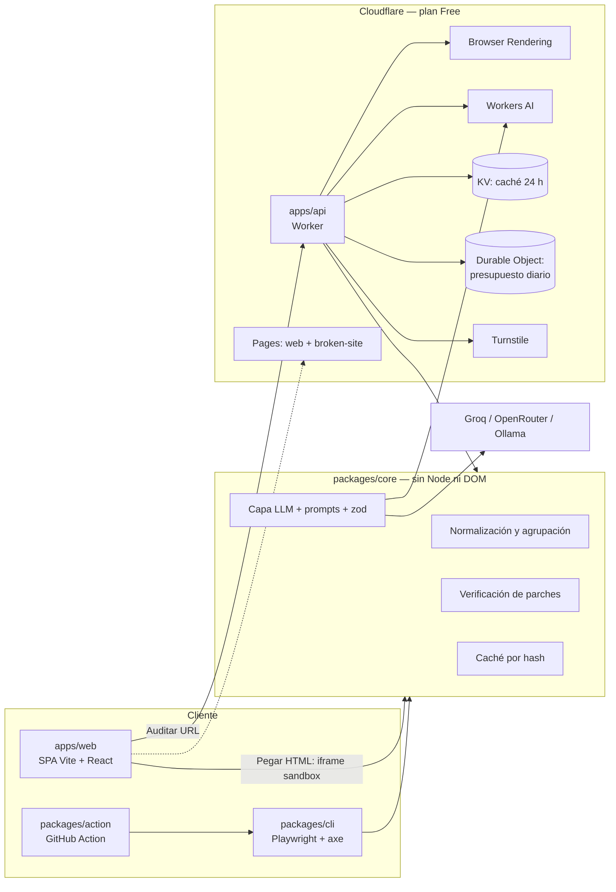

# Allytic — documento vivo de idea y decisiones

> Fuente de verdad del proyecto. Se actualiza en el mismo commit que cualquier cambio de
> funcionalidad, arquitectura, stack, alcance, límites o decisiones (ver `CLAUDE.md`).
>
> Estado: **fase 1 completada** (esqueleto, CI, documentación y sitio de ejemplo desplegado en
> <https://allytic-broken-site.pages.dev>).
> Última revisión: 2026-10-07.

## 1. Visión y problema

Los auditores automáticos de accesibilidad (axe, Lighthouse, WAVE) dicen **qué** falla, pero
dejan dos huecos: quien recibe el informe a menudo no entiende a quién perjudica el problema, y
el arreglo queda como trabajo manual. Los asistentes de IA cubren ese hueco con sugerencias que
nadie comprueba: un parche plausible puede no arreglar la regla o romper otra.

Allytic detecta problemas WCAG 2.2 AA con axe-core y usa un LLM para:

1. Explicar cada problema en lenguaje claro: a quién afecta y por qué.
2. Proponer un parche concreto (antes / después).
3. **Verificar el parche**: aplicarlo y volver a ejecutar axe. Solo se marca "Verificado" si la
   regla deja de fallar y no aparecen violaciones nuevas. Si falla, un único reintento pasando al
   modelo el error.

**Principio de honestidad.** Las pruebas automáticas cubren solo una parte de WCAG. Allytic
nunca afirma "cumplimiento" ni "conformidad legal", y lo dice en la interfaz y en cada informe.

## 2. Usuarios objetivo

- **Desarrolladores web** que quieren arreglar problemas, no solo listarlos (CLI y Action).
- **Equipos pequeños sin especialista en accesibilidad**, que necesitan entender el impacto.
- **Quien evalúa el portfolio**: debe poder ver el valor en un minuto con el modo demo, sin
  registrarse ni gastar cuota.

## 3. Alcance

**MVP**

- CLI `allytic audit <url|archivo>` con salidas JSON, Markdown, HTML autocontenido y SARIF.
- Explicación + parche + verificación con LLM, caché y límite de llamadas.
- API en Cloudflare Workers para auditar URLs con protección anti-SSRF y presupuesto diario.
- Web con modos demo, auditar URL, pegar HTML (100 % cliente), ver informe y BYOK.
- Evals reproducibles que comparan modelos gratuitos.
- GitHub Action que sube SARIF y comenta el PR.

**Siguiente**

- Rastreo de varias páginas de un mismo sitio.
- Parches sobre el código fuente (hoy se parchea el DOM renderizado).
- Más idiomas en las explicaciones.

**Descartado**

- Declaraciones de conformidad o certificación legal: no se pueden respaldar con pruebas automáticas.
- Auditorías de páginas tras inicio de sesión en la demo pública (riesgo de credenciales).
- Overlays o "arreglos" inyectados en producción: no resuelven el problema de fondo.
- Mostrar auditorías de sitios de terceros como ejemplo público.

## 4. Arquitectura

Monorepo pnpm con TypeScript estricto:

| Workspace | Responsabilidad | Fase |
| --- | --- | --- |
| `packages/core` | Tipos de dominio, normalización y agrupación de resultados de axe, capa LLM, prompts, esquemas zod, caché y verificación. API pública sin dependencias de Node ni del DOM. | 2–3 |
| `packages/cli` | `allytic audit`, Playwright + `@axe-core/playwright`, formatos de salida. | 2 |
| `packages/action` | GitHub Action sobre la CLI: SARIF + comentario en PR. | 6 |
| `apps/api` | Worker que orquesta auditorías por URL. | 3b |
| `apps/web` | SPA accesible desplegada en Pages. | 5 |
| `fixtures/broken-site` | Sitio con errores intencionados; único objetivo de la demo pública. | 1 |
| `evals/` | Dataset y script de comparación de modelos. | 4 |

## 5. Decisiones técnicas (ADR)

### ADR-001 · Cloudflare frente a Vercel, Netlify y GitHub Pages

- **Contexto.** Hace falta alojar una SPA, una API con navegador headless y un LLM, a coste 0 € y
  sin tarjeta.
- **Decisión.** Cloudflare (Pages, Workers, Browser Rendering, Workers AI, KV, Durable Objects,
  Turnstile).
- **Alternativas.** *Vercel / Netlify*: funciones serverless gratuitas, pero sin navegador
  gestionado ni inferencia incluida; ejecutar Chromium en una función choca con límites de tamaño
  y tiempo, y el plan gratuito de Vercel excluye uso comercial. *GitHub Pages*: solo estático, sin
  API. *VPS gratuito*: suele exigir tarjeta y mantenimiento.
- **Consecuencias.** Un único proveedor y una sola herramienta (Wrangler). A cambio, límites
  duros (10 ms de CPU, 10 min de navegador al día) que condicionan el diseño, y acoplamiento a
  APIs propias, mitigado manteniendo `core` libre de dependencias de plataforma.

### ADR-002 · Nombre "Allytic" (antes "Curbcut")

- **Contexto.** `curbcut` y `curbcut-cli` ya existen en npm y pertenecen a otra herramienta de
  accesibilidad.
- **Decisión.** Renombrar a **Allytic**. `allytic` estaba libre en npm el 2026-10-07.
- **Alternativas.** Publicar bajo scope propio (mantiene la confusión de marca); posponer la
  decisión a la fase 6 (renombrar tarde afecta a README, Action y docs).
- **Consecuencias.** Los paquetes internos usan el scope `@allytic/*`; publicarlos exigirá crear
  esa organización en npm (gratis para paquetes públicos) en la fase 6. La carpeta local conserva
  el nombre antiguo, sin efecto en el repo.

### ADR-003 · Anti-SSRF en dos capas, con riesgo residual declarado

- **Contexto.** El requisito original pedía "comprobar la IP resuelta". En Workers no se puede
  fijar una conexión a una IP ya validada, y quien navega es el navegador remoto, no el Worker.
  Validar por DNS y navegar después es un TOCTOU: el DNS rebinding no se elimina por completo.
- **Decisión.** (1) Validación en el Worker: solo http(s), puertos permitidos, rechazo de IP
  literales privadas / loopback / link-local / metadata en IPv4 e IPv6, resolución DoH de A y
  AAAA. (2) Interceptación en el navegador con `page.route` de **todas** las peticiones
  (redirecciones y subrecursos), revalidando cada destino; máximo 3 redirecciones; service workers
  bloqueados; timeout y tamaño máximo.
- **Alternativas.** Solo validar el nombre (insuficiente); proxy propio con IP fijada (requiere
  infraestructura de pago).
- **Consecuencias.** Los tests de rebinding prueban el validador con un resolver simulado, no
  una garantía absoluta. Riesgo residual documentado; el impacto es limitado porque el navegador
  corre en la red de Cloudflare, no en una red nuestra.

### ADR-004 · Rate limit y presupuesto fuera de KV

- **Contexto.** KV Free permite 1.000 escrituras/día, compartidas con la caché, y es
  eventualmente consistente: como contador se agota pronto y cuenta mal.
- **Decisión.** Binding de Rate Limiting de Workers para el límite por IP (aproximado, por
  ubicación) y un Durable Object con SQLite para el presupuesto diario global (exacto). KV queda
  solo para caché de resultados.
- **Alternativas.** Todo en KV (descartado por lo anterior); todo en Durable Objects (válido,
  más código).
- **Consecuencias.** Un binding más. Pendiente de confirmar en 3b que el binding de Rate Limiting
  funciona en el plan Free; si no, el Durable Object asume también el límite por IP.

### ADR-005 · Groq como respaldo de servidor; OpenRouter para BYOK y evals

- **Contexto.** Los modelos `:free` de OpenRouter admiten 50 peticiones/día sin haber comprado
  créditos.
- **Decisión.** Cadena en servidor: Workers AI → Groq → explicación estática de axe. OpenRouter
  se usa en BYOK y en evals (repartidas en varios días o con subconjunto).
- **Consecuencias.** Las evals de OpenRouter no se pueden ejecutar completas en un día.

### ADR-006 · Estados de verificación y ámbito del parche

- **Contexto.** Reejecutar axe "sobre el nodo" no sirve para reglas de documento
  (`html-has-lang`, `document-title`, `heading-order`) ni para contraste definido en CSS externo.
- **Decisión.** Cada parche declara su ámbito (nodo o documento) y el resultado tiene tres
  estados: **Verificado**, **Fallido** y **No verificable automáticamente**.
- **Consecuencias.** La métrica principal de las evals es el % de parches verificados sobre los
  verificables; los no verificables se informan aparte.

### ADR-007 · Pages con direct upload

- **Contexto.** Cloudflare ofrece Pages y Workers Static Assets para estáticos.
- **Decisión.** Pages, desplegando con `wrangler pages deploy` desde GitHub Actions.
- **Alternativas.** Integración Git de Pages (consume las 500 builds/mes y duplica la CI);
  Workers Static Assets (válido; se reconsiderará si `apps/web` y `apps/api` acaban compartiendo
  dominio).
- **Consecuencias.** El despliegue vive en el repo y es reproducible; no consume builds de Pages.

### ADR-008 · Límites conocidos de SARIF y del comentario en PR

- **Contexto.** GitHub Code Scanning necesita rutas de fichero del repositorio.
- **Decisión.** Para auditorías de URL, el SARIF referencia la URL como artefacto lógico; para
  builds estáticos, el HTML generado. Si el PR viene de un fork (token de solo lectura), la Action
  escribe el resumen en el *job summary* en lugar de comentar.
- **Consecuencias.** Las alertas no apuntan al código fuente original. Documentado en
  limitaciones.

## 6. Stack y por qué

| Pieza | Elección | Motivo |
| --- | --- | --- |
| Runtime | Node 24 LTS | LTS vigente (Node 20 terminó su soporte en abril de 2026). |
| Gestor de paquetes | pnpm 12 (vía corepack) | Workspaces estrictos, instalación rápida, scripts de build bloqueados por defecto. |
| Lenguaje | TypeScript 7, `strict` + `noUncheckedIndexedAccess` + `exactOptionalPropertyTypes` | Tipado sin `any`; errores en compilación. |
| Lint y formato | Biome 2 | Una sola herramienta y un solo binario. `noExplicitAny` como error. |
| Tests | Vitest 5 (unitarios), Playwright Test (e2e, desde fase 2) | Estándar de facto en el ecosistema Vite. |
| Motor de reglas | axe-core | Referencia del sector, bajo ratio de falsos positivos. |
| Validación | zod | Esquemas para la salida del LLM y los mensajes entre capas. |
| Despliegue | Wrangler 4 | CLI oficial de Cloudflare, usada en local y en Actions. |
| Versionado | Changesets | Changelog y publicación en npm por PR. |

**Dependencias de la fase 1** (todas de desarrollo, en la raíz): `typescript`,
`@biomejs/biome`, `vitest`, `wrangler`, `@changesets/cli`. Cualquier dependencia nueva se
justifica aquí antes de añadirse.

pnpm solo permite scripts de instalación a `esbuild` y `workerd` (los necesita Wrangler); está
declarado en `pnpm-workspace.yaml`.

## 7. Límites de los planes gratuitos

Comprobados el **2026-10-07** en la documentación oficial. Hay que volver a comprobarlos antes
de la fase 3b.

| Servicio | Límite del plan Free | Fuente |
| --- | --- | --- |
| Workers | 10 ms de CPU por petición · 100.000 peticiones/día · 50 subpeticiones por petición · 128 MB | [limits](https://developers.cloudflare.com/workers/platform/limits/) |
| Browser Rendering | 10 min de navegador/día · 3 navegadores concurrentes · 1 navegador nuevo cada 20 s · timeout de 60 s | [limits](https://developers.cloudflare.com/browser-rendering/platform/limits/) |
| Workers AI | 10.000 neurons/día; al agotarse, las llamadas fallan con error | [pricing](https://developers.cloudflare.com/workers-ai/platform/pricing/) |
| KV | 100.000 lecturas/día · 1.000 escrituras/día · 1 escritura/s por clave · 1 GB · TTL mínimo 30 s | [limits](https://developers.cloudflare.com/kv/platform/limits/) |
| Durable Objects | Solo backend SQLite · 100.000 peticiones/día · 100.000 filas escritas/día · 5 GB | [pricing](https://developers.cloudflare.com/durable-objects/platform/pricing/) |
| Pages | 500 builds/mes (no aplican con direct upload) · 20.000 ficheros · 25 MiB por fichero | [limits](https://developers.cloudflare.com/pages/platform/limits/) |
| OpenRouter `:free` | 20 peticiones/min · 50 peticiones/día sin créditos comprados | [limits](https://openrouter.ai/docs/api-reference/limits) |

Coste en neurons por millón de tokens (entrada / salida), misma fecha: Llama 3.3 70B
26.668 / 204.805 · Llama 3.1 8B 25.608 / 75.147 · Mistral Small 24B 31.876 / 50.488.
El modo JSON de Workers AI solo está disponible en algunos modelos y no garantiza el esquema:
la validación con zod y el reintento son obligatorios.

**Cómo se diseña para no superarlos**

- Modo demo precalculado por defecto: cero consumo de navegador y de IA.
- Presupuesto diario global en un Durable Object, por debajo de los límites reales; al agotarse,
  error tipado y la web sugiere la CLI o "Pegar HTML".
- axe se ejecuta dentro del navegador remoto y los resultados se recortan allí; el Worker solo
  orquesta (10 ms de CPU).
- Tope de grupos enviados al LLM por auditoría y caché de 24 h por hash.
- Estimación propia, pendiente de medir en 3b: unas 20–40 auditorías/día por tiempo de navegador y
  10–15 con parches por neurons con un modelo de 70B.

## 8. Seguridad y privacidad

- **SSRF.** Ver ADR-003. Tests específicos: IPv4 e IPv6 privadas, `localhost`,
  `169.254.169.254`, redirección a IP interna, rebinding con resolver simulado, esquemas no
  http(s).
- **Abuso.** Turnstile en cada envío, rate limit por IP, presupuesto diario global y CORS
  restringido al dominio de la web.
- **Prompt injection.** El HTML auditado es entrada no confiable: se delimita como datos en el
  prompt, se limita su longitud y nunca se siguen instrucciones que contenga. La salida se valida
  con zod y el parche solo cuenta si axe lo verifica.
- **BYOK.** La clave de OpenRouter del usuario vive en memoria (o en `sessionStorage` si lo
  marca), se envía directamente del navegador a OpenRouter y nunca a nuestro backend. Se avisa en
  la interfaz.
- **Pegar HTML.** Se renderiza en `<iframe sandbox="allow-scripts" srcdoc>` sin
  `allow-same-origin`; la comunicación por `postMessage` valida origen y forma.
- **Secretos.** Solo como secrets de Wrangler o de GitHub. En el repo, únicamente
  `.env.example` y `.dev.vars.example`. Tokens con permisos mínimos.
- **Cadena de suministro.** Acciones de GitHub fijadas por SHA, `permissions: contents: read`
  por defecto, versiones exactas de dependencias y scripts de instalación en lista blanca.

## 9. Limitaciones conocidas

- Las pruebas automáticas detectan solo una parte de los problemas WCAG; el resto exige revisión
  manual y pruebas con personas usuarias de tecnologías de apoyo. Ejemplo incluido a propósito en
  `fixtures/broken-site`: el indicador de foco eliminado por CSS no lo detecta axe.
- "Verificado" significa que axe ya no informa de la regla en el DOM parcheado, no que el arreglo
  sea el mejor ni que el texto alternativo generado sea correcto.
- Los parches se aplican al DOM renderizado, no al código fuente.
- El DNS rebinding no se puede descartar por completo (ADR-003).
- La demo pública tiene cuota diaria y puede no estar disponible al agotarse.
- SARIF no apunta al código fuente original (ADR-008).
- El catálogo de `fixtures/broken-site/README.md` es una especificación de lo esperado; se
  contrasta con la salida real de axe en la fase 2.

## 10. Resultados de evals

Pendiente (fase 4). Aquí se incluirá la tabla generada en `docs/evals.md`: % de parches
verificados, % que introducen nuevas violaciones, latencia, tokens y coste por modelo.

## 11. Roadmap

| Fase | Contenido | Estado |
| --- | --- | --- |
| 1 | Esqueleto del monorepo, CI, `CLAUDE.md`, `docs/IDEA.md`, `fixtures/broken-site`, despliegue en Pages | Hecha (CI y despliegue verificados el 2026-10-07) |
| 2 | Core + CLI: auditoría con axe, salidas JSON / Markdown / HTML / SARIF, sin LLM | Pendiente |
| 3 | Capa LLM, verificación de parches y caché | Pendiente |
| 3b | `apps/api`: empieza con un spike que mide la CPU de Playwright en Workers; después anti-SSRF, Turnstile, rate limit, Browser Rendering, Workers AI, KV, presupuesto | Pendiente |
| 4 | Evals y tabla comparativa | Pendiente |
| 5 | Web: demo, auditar URL, pegar HTML, ver informe, BYOK | Pendiente |
| 6 | GitHub Action y publicación en npm con Changesets | Pendiente |
| 7 | Pulido de portfolio: README, GIF, accesibilidad de la propia web, artículo técnico | Pendiente |

## 12. Changelog de decisiones

| Fecha | Decisión |
| --- | --- |
| 2026-10-07 | Proyecto renombrado de "Curbcut" a "Allytic" por colisión en npm (ADR-002). |
| 2026-10-07 | Comprobados y anotados los límites de los planes gratuitos (sección 7). |
| 2026-10-07 | Anti-SSRF en dos capas con riesgo residual declarado, en lugar de "comprobar la IP resuelta" (ADR-003). |
| 2026-10-07 | Rate limit con binding de Workers y presupuesto en Durable Object; KV solo para caché (ADR-004). |
| 2026-10-07 | Groq como respaldo de servidor; OpenRouter para BYOK y evals (ADR-005). |
| 2026-10-07 | Tercer estado de verificación, "No verificable automáticamente" (ADR-006). |
| 2026-10-07 | Pages con direct upload desde GitHub Actions (ADR-007). |
| 2026-10-07 | Node 24 LTS, pnpm 12, TypeScript 7, Biome 2 y Vitest 5 como base. Sin project references de TypeScript por ahora: no hay imports entre paquetes; se añadirán en la fase 2. |
| 2026-10-07 | El despliegue del sitio de ejemplo incluye un smoke test que lee la URL del fichero de salida de Wrangler y espera al certificado TLS. |
| 2026-10-07 | El sitio de ejemplo se sirve sin CSP para no interferir con la inyección de axe; no contiene scripts. |
